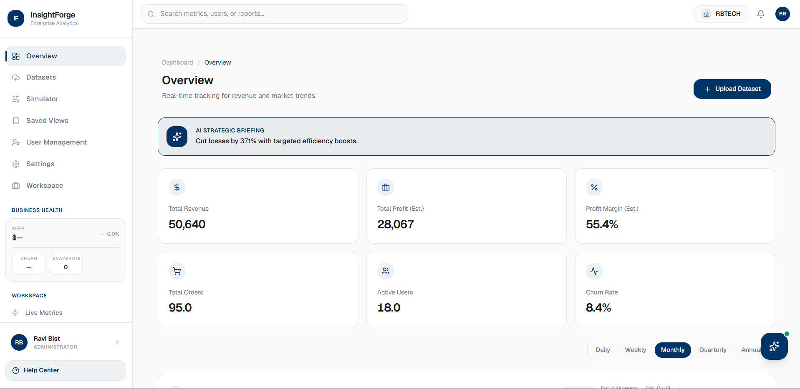
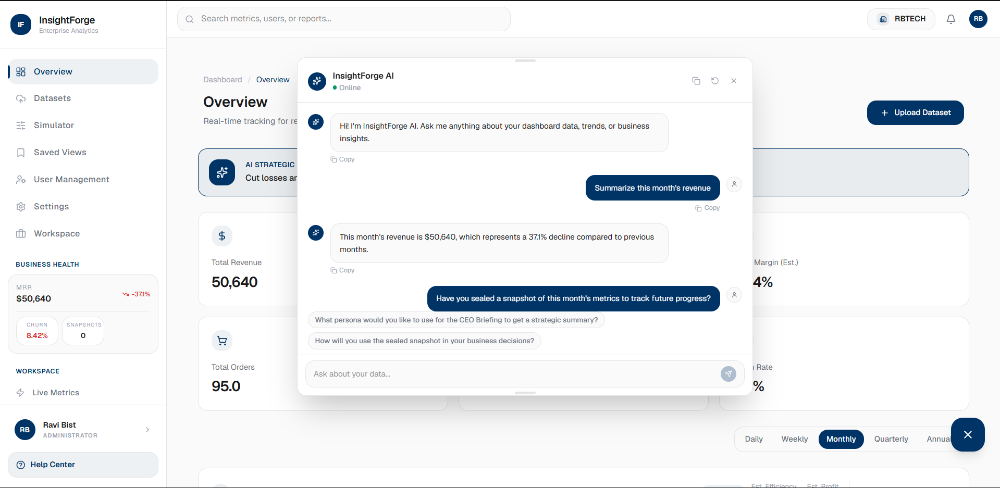
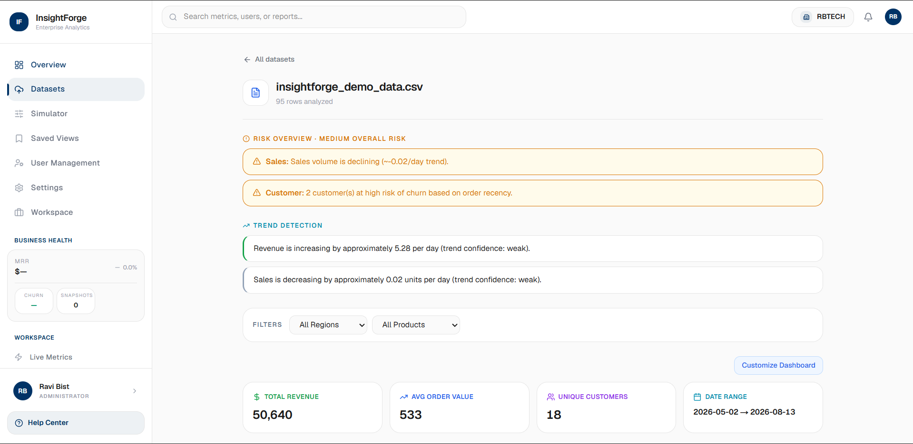
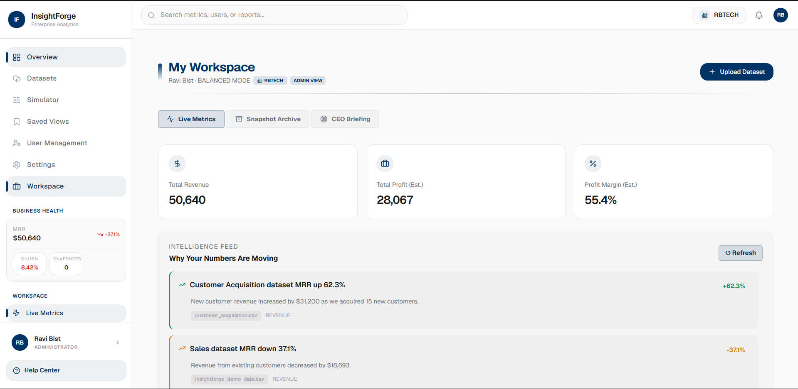
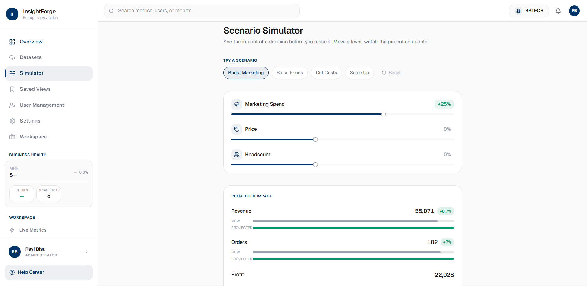
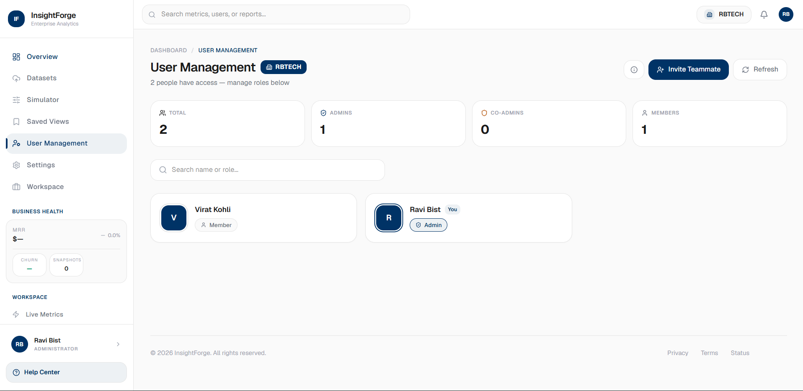

<div align="center">


# InsightForge

### AI-Powered Analytics Dashboard for Teams
Upload messy CSV/Excel data → get cleaned datasets, forecasts, and AI-explained insights, scoped per company.

[](https://insight-forge-dashboard.vercel.app)
[](#deployment)
[](https://groq.com/)

[](https://nextjs.org/)
[](https://www.typescriptlang.org/)
[](https://fastapi.tiangolo.com/)
[](https://www.python.org/)
[](https://supabase.com/)
[](LICENSE)
[](https://github.com/RaviBist18/InsightForge_Dashboard/commits)

</div>

______________________________________________________________________________________________________________________________________________________
## Why this exists

Most small teams run on scattered CSV exports — sales, inventory, marketing spend — with no analyst on staff to clean it or explain what it means. Spreadsheets answer "what happened," not what's coming next.

Manually digging through that data usually means:

* Column headers that don't match, need manual re-mapping every upload
* Duplicates and outliers nobody catches until a report is already wrong
* No forecast — just this month's numbers, no read on next month
* No easy way to ask "why," just raw numbers on a chart

InsightForge closes that gap. Upload a CSV or Excel file and get back:

* Auto-detected columns — revenue, customer ID, date, region — no manual mapping
* Duplicates and outliers flagged automatically
* Real regression-based forecasts — revenue, sales, inventory, churn, marketing ROI, risk
* An AI chat that already knows your exact metrics, so you can just ask

All computed from your actual uploaded data — not a canned demo number.
_______________________________________________________________________________________________________________________________________________________

## Screenshots

| Dashboard | AI Chat | Data Sources |
|---|---|---|
|  |  |  |

| My Workspace | Simulator | Team |
|---|---|---|
|  |  |  |
_______________________________________________________________________________________________________________________________________________________
## What it does
| Capability | Description |
|---|---|
| 📁 **Smart Data Ingestion** | Upload CSV/XLSX (up to 20MB, rate-limited 10/min) → auto column-role detection (revenue, customer ID, date, region), duplicate + outlier flagging, automatic feature engineering |
| 📊 **KPI Dashboard** | Revenue, profit, orders, users, churn rate, margin — with 7/30/90-day time filters and category filters |
| 🔮 **Forecasting (Real Regression Models)** | `scikit-learn` `LinearRegression` powers revenue forecast, sales forecast, inventory forecast, and marketing ROI prediction — trained per-dataset, not hardcoded |
| ⚠️ **Churn, Risk & Opportunity Detection** | Per-dataset churn prediction, risk scoring, and opportunity/trend detection endpoints built on the same regression pipeline |
| 🎛️ **What-if Simulator** | Adjust levers (price, spend, etc.) and see projected revenue/orders/profit via an elasticity model — explicitly labeled `"confidence": "estimated"`, not a trained forecast |
| 🤖 **AI Chat + Copilot** | Groq (Llama 3.1) chat that's context-aware of your dataset's actual metrics; separate copilot endpoint explains individual charts; AI-generated briefing summaries |
| 👥 **Multi-tenant Teams** | Company-scoped data (every row and storage path keyed by `company_id`), team invites via email (Nodemailer), join-request approval flow, admin user management |
| 🔐 **Auth** | Supabase Auth — Google OAuth + email/password, password reset flow, JWT verified backend-side against Supabase JWKS |
| 💾 **Reports & Saved Views** | Generate/export reports, bookmark filter combinations as saved views |
| 🖥️ **Monitoring** | Sentry error tracking wired into the backend in production |
_______________________________________________________________________________________________________________________________________________________

## Results

> Numbers below are counted from the codebase (real). Performance numbers need a real measurement pass — marked `TODO` rather than guessed.

- ✅ **24** REST endpoints across data ingestion, forecasting, analytics, and admin (see API reference)
- ✅ **6** regression-backed prediction endpoints (revenue, sales, inventory, churn, marketing ROI, risk) — real `scikit-learn` models fit per request, not mocked
- ✅ **Multi-tenant** — every dataset and storage path scoped by `company_id`, verified via JWT on every request
- ✅ Upload pipeline auto-detects column roles, duplicates, and outliers — no manual schema mapping
- ✅ **~3s** average response time for forecast/analytics endpoints
- ✅ Tested up to **100 rows** per dataset

_______________________________________________________________________________________________________________________________________________________
## How it works

```
 Upload — FastAPI (Render)
   You upload a CSV or Excel file. Backend validates it,
   parses it with pandas.
         ↓
 Analyze — pandas
   Column roles auto-detected (revenue, customer ID, date,
   region), duplicates and outliers flagged, derived
   features engineered — no manual schema mapping.
         ↓
 Store — Supabase Storage + Postgres
   Raw file saved to Storage, scoped under your company_id.
   Schema and analysis metadata saved to Postgres.
         ↓
 Request an insight — on demand
   Whenever you open a forecast, KPI, or analytics view,
   the backend re-reads the stored file and computes fresh —
   nothing is pre-baked, so numbers stay current if the
   dataset changes.
         ↓
 Forecast / predict — scikit-learn
   LinearRegression fit on your actual data for revenue,
   sales, inventory, marketing ROI, churn, and risk —
   trained per request, not a canned trend line.
         ↓
 Explain it — Groq LLaMA 3.1
   AI chat and copilot are context-aware of your real
   metrics — ask "why did revenue drop in June" and it
   answers from your actual numbers, not a guess.
         ↓
 Done — Next.js dashboard (Vercel)
   KPIs, charts, and AI answers render live in the
   dashboard.
```
_______________________________________________________________________________________________________________________________________________________

## Why I built it this way

| Area | Approach | Reasoning |
|---|---|---|
| **Multi-tenancy** | `company_id` resolved from JWT via a `memberships` table, folded into every Supabase query and storage path | A missed `WHERE` clause on a boolean flag is one bug away from a cross-tenant leak — scoping the storage path itself makes leaking another company's data structurally harder, not just policy-enforced |
| **Forecasting model** | `scikit-learn` `LinearRegression` fit fresh per dataset, not a hardcoded trend | The honest version of a forecast feature is a model that actually reads the uploaded data — a canned "+5% next month" would look identical in a demo but be worthless once someone uploads their own numbers |
| **What-if simulator** | Elasticity-based, explicitly labeled `"confidence": "estimated"` with a `basis` string, not presented as a trained forecast | Nothing here is trained on the company's actual price-sensitivity — showing it with the same confidence as the regression forecasts would be misleading |
| **Auth verification** | Supabase JWKS verification, not a shared secret | Avoids storing a duplicate signing secret in the backend; token verification stays correct even if Supabase rotates keys |
| **Ingestion limits** | `slowapi` rate limits `/upload` and `/clean` to 10/minute per IP | Parsing arbitrary uploaded CSV/Excel is the most expensive and most abusable path in the API — capped before it becomes a cost or DoS problem |
| **Computation timing** | Forecasts/analytics computed on-demand, not cached at upload time | Keeps numbers correct if the same dataset gets cleaned or re-analyzed later, at the cost of recomputing on every view |
| **Column detection** | Regex-based role detection (revenue, customer ID, date, region) instead of requiring manual column mapping | Most people uploading a CSV don't want a setup wizard first — auto-detection with a fallback to "unknown" role handles the common case without forcing configuration |
_______________________________________________________________________________________________________________________________________________________

## Tech stack

### Frontend

| Technology | Purpose |
|---|---|
| Next.js 16 (App Router) | React framework, routing |
| TypeScript | Type safety |
| Tailwind CSS v4 | Styling |
| shadcn/ui + Radix UI | Component primitives |
| Framer Motion | Animations |
| Recharts | Charts |
| TanStack Query | Data fetching/caching |
| Zod | Schema validation |

### Backend

| Technology | Purpose |
|---|---|
| FastAPI | REST API — 24 endpoints |
| PyJWT | JWKS-based token verification |
| slowapi | Rate limiting on upload/clean endpoints |
| Sentry SDK | Error monitoring |

### Data & AI pipeline

| Technology | Purpose |
|---|---|
| pandas | CSV/Excel parsing, column detection, cleaning |
| NumPy | Numeric computation |
| scikit-learn (LinearRegression) | Revenue, sales, inventory, churn, risk, marketing-ROI forecasting |
| Groq SDK | LLM inference (LLaMA 3.1) — AI chat, copilot, briefings |

### Infra

| Technology | Purpose |
|---|---|
| Vercel | Frontend deployment (Docker standalone build) |
| Render | Backend deployment (Docker) |
| Supabase | Postgres, Auth, Storage |
| Nodemailer | Team invite emails |
| Sentry | Error monitoring, 10% trace sample in production |
Caveman — real tree, cleaned up:

_______________________________________________________________________________________________________________________________________________________
## Project structure

```
InsightForge_Dashboard/
│
├── backend/
│   ├── main.py                          # FastAPI app — all 24 endpoints
│   ├── requirements.txt
│   └── Dockerfile
│
├── src/
│   ├── app/
│   │   ├── (dashboard)/
│   │   │   ├── dashboard/
│   │   │   │   ├── [category]/          # KPI category detail view
│   │   │   │   ├── dashboard/[slug]/    # Individual KPI detail page
│   │   │   │   ├── admin/users/         # Admin — user management
│   │   │   │   ├── data-sources/        # CSV/XLSX upload
│   │   │   │   ├── datasets/            # Dataset list + analysis
│   │   │   │   ├── reports/
│   │   │   │   ├── saved-views/
│   │   │   │   ├── settings/
│   │   │   │   ├── simulator/           # What-if elasticity simulator
│   │   │   │   ├── team/                # Team management + invites
│   │   │   │   └── workspace/
│   │   │   └── insights/[id]/
│   │   │
│   │   ├── api/
│   │   │   ├── ai-chat/                 # Groq AI chat
│   │   │   ├── briefing/                # AI-generated summaries
│   │   │   ├── copilot/explain-chart/   # Per-chart AI explanation
│   │   │   ├── recommendations/
│   │   │   ├── onboarding/find-company/
│   │   │   ├── join-requests/           # Team join-request approval
│   │   │   ├── invite/                  # Team invite emails
│   │   │   ├── admin/pending-requests/
│   │   │   ├── data-sources-health/
│   │   │   ├── realtime-data/
│   │   │   └── workspace/
│   │   │
│   │   ├── auth/callback/               # Supabase OAuth callback
│   │   ├── onboarding/                  # Company create/join flow
│   │   └── privacy/, terms/, status/
│   │
│   ├── components/
│   │   ├── dashboard/                   # KPI cards, charts, AI chat widget
│   │   ├── layout/                      # Sidebar, navbar, shell
│   │   ├── common/                      # RoleGuard, shared UI
│   │   └── ui/                          # shadcn/ui primitives
│   │
│   ├── context/                         # Workspace, theme state
│   ├── hooks/
│   ├── lib/                             # Supabase clients, data fetching
│   └── data/                            # Mock/fallback data
│
├── docs/
│   ├── logo.png
│   └── screenshots/
│
├── middleware.ts                        # Session refresh + route protection
└── Dockerfile                           # Frontend standalone build
```
_______________________________________________________________________________________________________________________________________________________

## Production Environment Variables

### Backend (`backend/.env`)
```env
# Supabase
SUPABASE_URL=your_supabase_url
SUPABASE_SERVICE_ROLE_KEY=your_supabase_service_role_key

# Monitoring
SENTRY_DSN=your_sentry_dsn

# Set automatically by Render — do not set manually
RENDER=true
```

### Frontend (`.env.local`)
```env
# Supabase
NEXT_PUBLIC_SUPABASE_URL=your_supabase_url
NEXT_PUBLIC_SUPABASE_ANON_KEY=your_supabase_anon_key
SUPABASE_SERVICE_ROLE_KEY=your_supabase_service_role_key

# Backend
NEXT_PUBLIC_BACKEND_URL=https://your-render-backend-url.onrender.com
NEXT_PUBLIC_BASE_URL=http://localhost:3000
NEXT_PUBLIC_APP_URL=http://localhost:3000

# AI
GROQ_API_KEY=your_groq_api_key
GROQ_API_KEY_COPILOT=your_groq_api_key_for_copilot

# External data
NEXT_PUBLIC_ALPHA_VANTAGE_KEY=your_alpha_vantage_key
ALPHA_VANTAGE_KEY=your_alpha_vantage_key
NEWS_API_KEY=your_news_api_key

# Email (team invites)
GMAIL_USER=your_gmail_address
GMAIL_APP_PASSWORD=your_gmail_app_password
```
---

## Running it locally

### Prerequisites
```
Node.js v18+
Python 3.12+
Git
A Supabase project
A Groq API key
```
### 1. Clone
```bash
git clone https://github.com/RaviBist18/InsightForge_Dashboard.git
cd InsightForge_Dashboard
```

### 2. Backend
```bash
cd backend
python3 -m venv venv && source venv/bin/activate   # Windows: venv\Scripts\activate
pip install -r requirements.txt
```
Set up `backend/.env` — see [Environment Variables](#production-environment-variables) above.

### 3. Run Backend
```bash
uvicorn main:app --reload --port 8000
```

### 4. Frontend
```bash
cd ..
npm install
```
Set up `.env.local` — see [Environment Variables](#production-environment-variables) above.
```bash
npm run dev
```
_______________________________________________________________________________________________________________________________________________________
## API reference

### Data
| Method | Endpoint | Description |
|---|---|---|
| POST | `/upload` | Upload CSV/XLSX — auto column detection, dupes, outliers, feature engineering |
| POST | `/datasets/{id}/clean` | Apply cleaning actions (remove duplicates, fill nulls) |
| GET | `/datasets` | List datasets (optionally `mine=true`) |
| GET | `/datasets/{id}` | Get dataset metadata |
| DELETE | `/datasets/{id}` | Delete dataset |
| GET | `/datasets/{id}/filter-options` | Available filter values for a dataset |

### KPIs & analytics
| Method | Endpoint | Description |
|---|---|---|
| GET | `/datasets/{id}/kpis` | Core KPI summary — revenue, profit, orders, users, churn, margin |
| GET | `/datasets/{id}/customer-analytics` | Top customers by orders/revenue, repeat vs one-time segmentation |
| GET | `/datasets/{id}/sales-analytics` | Sales breakdown, filterable by region/product |
| GET | `/datasets/{id}/marketing-analytics` | Marketing performance breakdown |
| GET | `/datasets/{id}/inventory-analytics` | Inventory breakdown |

### Forecasting & prediction (scikit-learn)
| Method | Endpoint | Description |
|---|---|---|
| GET | `/datasets/{id}/revenue-forecast` | Revenue forecast — `LinearRegression` fit on historical data |
| GET | `/datasets/{id}/sales-forecast` | Sales forecast |
| GET | `/datasets/{id}/inventory-forecast` | Inventory forecast |
| GET | `/datasets/{id}/marketing-roi-prediction` | Predicted revenue at a hypothetical spend level |
| GET | `/datasets/{id}/churn-prediction` | Churn prediction |
| GET | `/datasets/{id}/customer-lifetime-value` | CLV estimate |
| GET | `/datasets/{id}/risk-prediction` | Risk scoring |
| GET | `/datasets/{id}/opportunity-detection` | Opportunity detection |
| GET | `/datasets/{id}/trend-detection` | Trend detection |

### Simulator
| Method | Endpoint | Description |
|---|---|---|
| POST | `/simulate` | What-if lever simulation — elasticity-based, `"confidence": "estimated"` |

### System
| Method | Endpoint | Description |
|---|---|---|
| GET | `/health` | Health check |

Every dataset-scoped route resolves `company_id` from the caller's Supabase JWT (verified against JWKS) and filters every query by it.
_______________________________________________________________________________________________________________________________________________________
## Current Scope

- Forecasts use single-variable `LinearRegression` — no seasonality modeling, no ensemble methods, no cross-validation reported to the user.
- What-if simulator runs on generic elasticity ranges, not a model trained on the company's own price/spend history — labeled `"confidence": "estimated"`, not presented as a real forecast.
- No automated test suite yet.
- Tested up to ~100 rows per dataset — larger files not yet verified.

---

## Disclaimer

InsightForge provides AI-generated forecasts and business insights, not financial or business advice. Forecasts are statistical estimates based on your uploaded data — verify critical business decisions independently before acting on them.

_______________________________________________________________________________________________________________________________________________________
## License

MIT — see [LICENSE](LICENSE) for details.

_______________________________________________________________________________________________________________________________________________________
## Author

**Ravi Bist**

[](https://github.com/RaviBist18)
[](https://www.linkedin.com/in/ravi-bist-vk1418)

---

<div align="center">

**InsightForge** — Upload your data. Get real forecasts, not guesses.

*Built to prove the numbers are real, not just the UI.*

</div>
